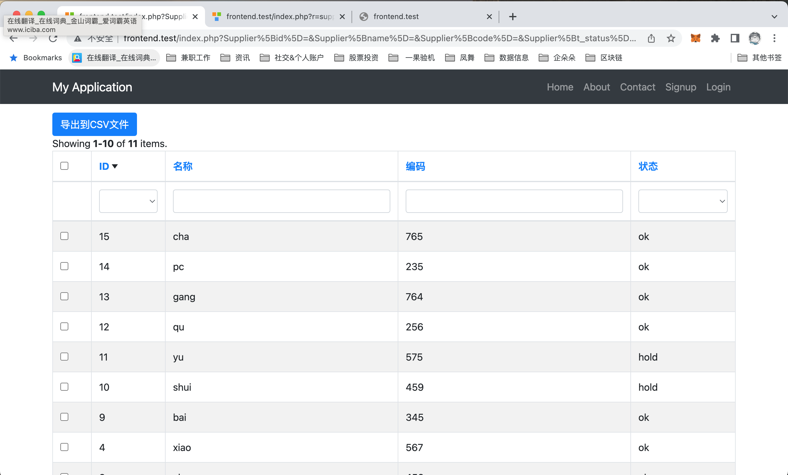

### Yii2 GridView 测试使用

访问 index.php?r=supplier/list 测试GridView

## yii-gridview-test/frontend/controllers/SupplierController.php
```php
    public function actionList()
    {
        $supplier = new Supplier();
        $provider = $supplier->search(Yii::$app->request->get());

        return $this->render('supplier-list', [
            'model' => $supplier,
            'provider' => $provider,
        ]);
    }

```

## yii-gridview-test/frontend/models/Supplier.php
```php
    public function search($params)
    {
        $query = self::find();
        $provider = new ActiveDataProvider([
            'query' => $query,
            'pagination' => [
                'pageSize' => 10,
                'pageParam' => 'p',
                'pageSizeParam' => 'pageSize',
            ],
            'sort' => [
                'defaultOrder' => [
                    'id' => SORT_DESC,
                ],
                'attributes' => [
                    'id', 'name', 'code', 't_status'
                ],
            ],
        ]);

        if (!($this->load($params) && $this->validate())) {
            return $provider;
        } 
        // fix id传空bug
        if (!empty($this->id)) {
            $query->andFilterWhere([$this->id, 'id', 10]);
        }

        $query->andFilterWhere(['like', 'name', $this->name])
              ->andFilterWhere(['like', 'code', $this->code])
              ->andFilterWhere(['t_status' => $this->t_status]);

        return $provider;
    }

```

## yii-gridview-test/frontend/views/supplier/supplier-list.php
```php
echo GridView::widget([
    'id' => 'mySupplierGridView',
    'dataProvider' => $provider,
    'filterModel' => $model,
    'columns' => [
        ['class' => 'yii\grid\CheckboxColumn'],
        [
            'label' => 'ID',
            'attribute' => 'id',
            'format' => 'raw',
            'headerOptions' => [
                'style' => 'width:120px;',
            ],
            'filter' => ['>' => '>10', '<' => '<10', '<=' => '<=10', '>=' => '>=10', '='=> '=10', '<>' => '<>10'],

        ],
        [
            'label' => '名称',
            'attribute' => 'name',
            'format' => 'raw',
        ],
        [
            'label' => '编码',
            'attribute' => 'code',
            'format' => 'raw',
        ],
        [
            'label' => '状态',
            'filter' => ['ok' => 'ok', 'hold' => 'hold'],
            'attribute' => 't_status',
            'format' =>  'raw',
            'value' =>  function ($data) {
                return ($data->t_status == 'ok') ? 'ok' : (($data->t_status == 'hold') ? 'hold' : '');
            }
        ],
    ],
]);
```

## 运行截图

